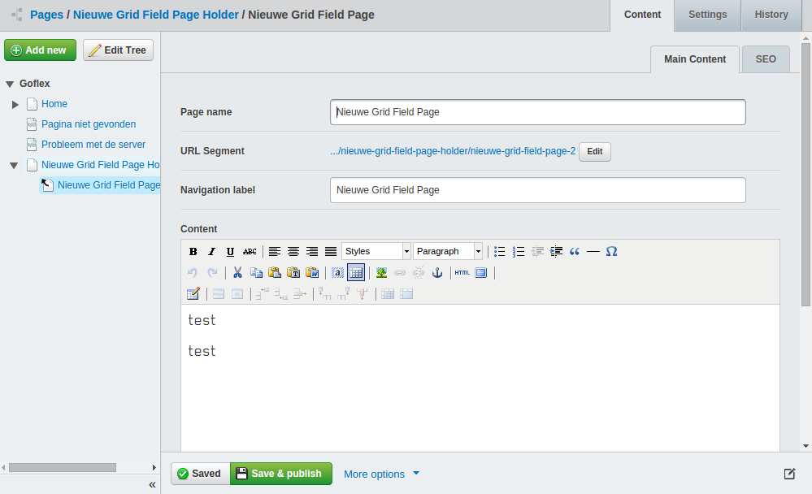

Manage pages from a gridfield instead of the sitetree
=====================================================

This module tackles the issue of a cluttered SiteTree by managing pages from a gridfield. It can easily handle thousands of subpages (production-tested with 65.000 pages under one parent).

This module is meant as base classes, it can be used on its own but usually you will want to subclass in order to add filtering/sorting, etc. An example module subclassing this module is Newsgrid (filterable newsitems managed from a gridfield).


## Features

* GridFieldPages extend SiteTree so no Page functionality is lost by using DataObjects.
* Custom GridField components for quickly adding new pages.
* Hides sub pages from the sitetree (via excludechildren).
* Drag 'n drop sorting of pages (optional) (loop over $SortedChildren in templates).


## Requirements

*These will get auto-installed when using composer:*

* SilverStripe 3.0 or newer
* PHP 5.4 or newer
* [silverstripe-excludechildren module to hide pages from the sitetree](https://github.com/micschk/silverstripe-excludechildren)
* [silverstripe-gridfieldsitetreebuttons to manage SiteTree items in a gridfield](https://github.com/micschk/silverstripe-gridfieldsitetreebuttons)

*Optional, for drag & drop sorting (suggested, not auto-installed by composer):*

* [silverstripe-gridfieldextensions for sorting pages in the gridfield (optional)](https://github.com/silverstripe-australia/silverstripe-gridfieldextensions)


## Installation

```
composer require micschk/silverstripe-gridfieldpages dev-master
```

## Optional: Drag & Drop Sorting

Drag and drop sorting is supported but not active by default, as often you will want to sort by other criteria, eg. Date or some other field. To activate drag & drop sorting, add to config.yml:
```yaml
GridFieldPageHolder:
  apply_sortable_gridfield: true
```

## Screenshots

*Easily manage and add new pages through a GridField.*


*Edit pages in the regular editform, including settings, history & versioning.*



## Recommended

Manage newsitems from a gridfield, with embargo & expire (auto-publishing) functionality
* [silverstripe-newsgrid](https://github.com/micschk/silverstripe-newsgrid)